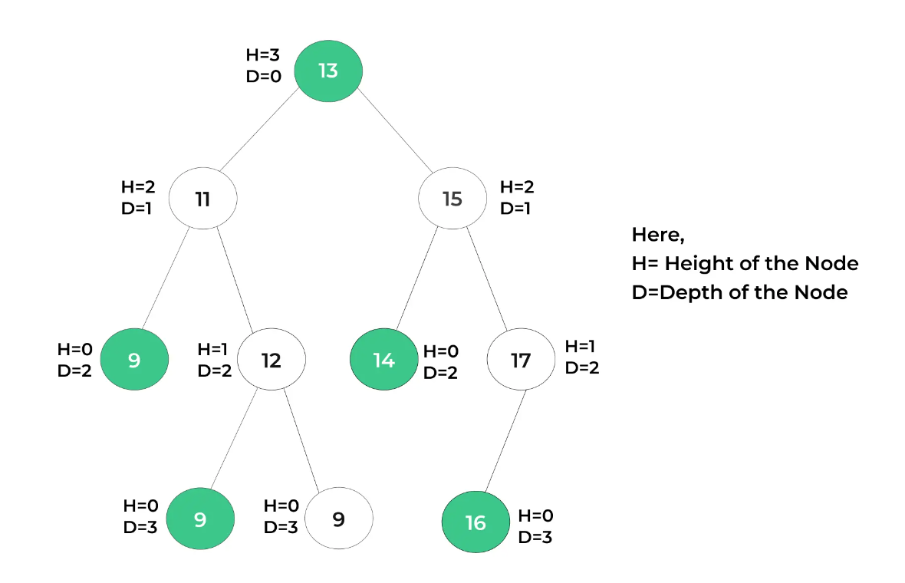

# Tree

A tree is a non-linear hierarchical data structure.
It is similar to linked list( doubly linked list) in which each node can contain data and link to other nodes.


<p align="center">
  
</p>


## Terms

1. Node: Hold data

2. Root: Topmost node

3. Relationship: Parent-child, sibling etc.

4. Leaf Node: Which have no children.

5. Path: Sequence of node from one node to another.


## Tree Depth and Height


<p align="center">
  
</p>

1. Height of a Node: Number of edges from the root
2. Depth of a Node: Number of edges to furthest leaf


## Binary Tree

1. Only 1 root node
2. At most 2 children per node


## Node Class

```
class Node {
    constructor(data) {
      this.data = data;
      this.left = null;
      this.right = null;
    }
}
```