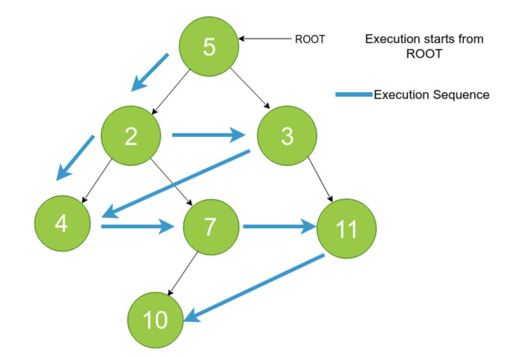

# Breadth First Traversal

Breadth First Traversal is to traverse a tree depth-wise(Level-wise).
First traverse root, then its children(From Left to Right) then children of children.


<p align="center">
  
</p>


## Node Class

```
class Node {
    constructor(data) {
        this.data = data;
        this.left = null;
        this.right = null;
    }
}
```

## Solution

<details>

<summary>Depth First Traversal Using Queue</summary>

```
function breadthFirstTraversal(root) {
    if(!root){
        return [];
    }

    const result = [];
    const queue = [];

    queue.push(root);

    while(queue.length > 0){
        const current = queue.shift();
        result.push(current.data);

        if(current.left){
            queue.push(current.left);
        }
        if(current.right){
            queue.push(current.right);
        }
    }

    return result;
}
```

</details>


<details>

<summary>Depth First Traversal Using Recursion</summary>

```
function depthFirstTraversal2(root){
    const result = [];

    function traverse(node) {
        if(node !== null) {
            result.push(node.data);
            traverse(node.left);
            traverse(node.right);
        }
    }

    traverse(root);
    return result;
}
```

</details>