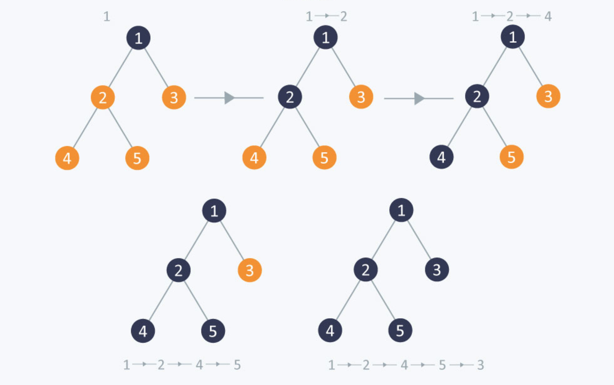

# Depth First Traversal

Depth First Traversal is to traverse a tree depth-wise(From leftmost to rightmost).


<p align="center">
  
</p>


## Node Class

```
class Node {
    constructor(data) {
        this.data = data;
        this.left = null;
        this.right = null;
    }
}
```

## Solution

<details>

<summary>Depth First Traversal Using Slack</summary>

```
function depthFirstTraversal(root) {
    if(!root) {
        return [];
    }

    const result = [];
    const stack = [];

    stack.push(root);

    while(stack.length > 0) {
        const current = stack.pop();
        result.push(current.data);

        if(current.right){
            stack.push(current.right);
        }

        if(current.left){
            stack.push(current.left);
        }
    }

    return result;
}
```

</details>

<details>

<summary>Depth First Traversal Using Recursion</summary>

```
function depthFirstTraversal2(root){
    const result = [];

    function traverse(node) {
        if(node !== null) {
            result.push(node.data);
            traverse(node.left);
            traverse(node.right);
        }
    }

    traverse(root);
    return result;
}
```

</details>