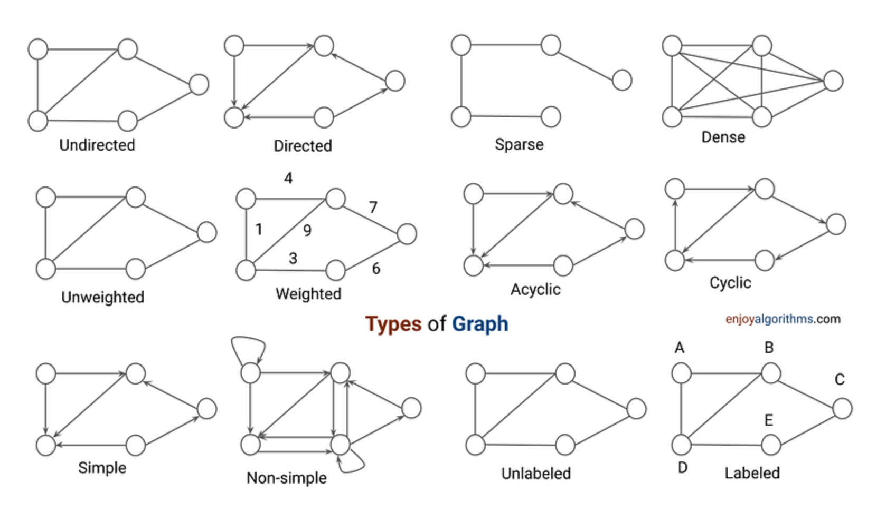
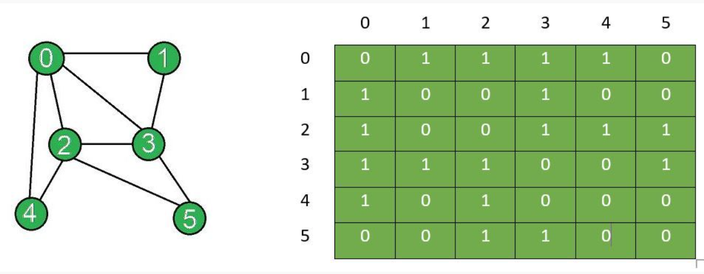
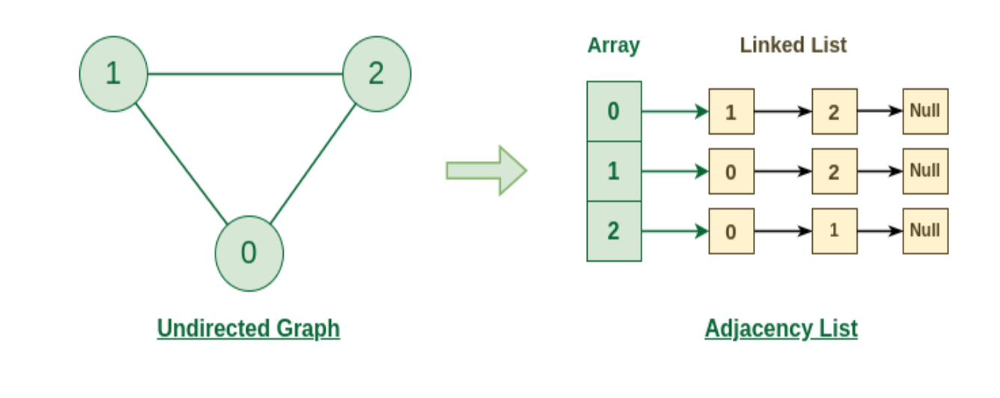

# Graph

Graphs are like trees.
Graph have nodes(or vertices) and edges(link or path).

  

## Graph Types

1. Undirected Graph

2. Directed Graph

3. Weighted Graph

4. Cyclic Graph

5. Acyclic Graph

6. Connected Graph

7. Disconnected Graph

8. Dense Graph

And Many more ....

## Adjacent Matrix
Here 1 represent path between i and j.

  

## Adjacency List

  

