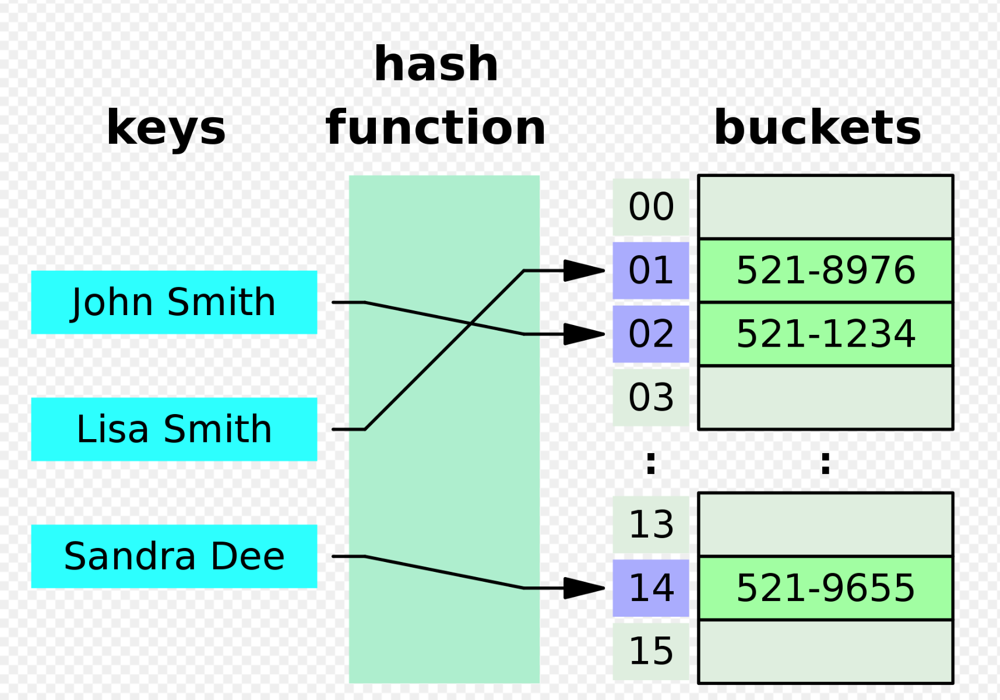

# Hash Table

A data structure that implements an associative array, also called a dictionary, which is an abstract data type that maps keys to values.

<p align="center">
  
</p>


## Complexity

The average time complexity for insertions, deletion is O(1).
Space complexity is O(n) becausewe have tos tore all keys and values in the has table. The size of hash table is proportional to the number of keys and values.


<details>

<summary>Common Methods</summary>

```
set(key, value) -> Add key/value pair

get(key) -> Return the value associated with key

remove(key) -> remove key/value pair

has(key) -> check if that key exits

keys() -> return array of all keys

values() -> return array of all values
```

</details>