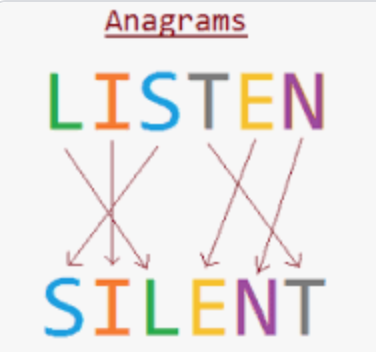

# Anagram Grouping

Write a function that takes an array of string and returns an array of arrays where each sub-array conatins words that are anagram of each-other.

#### What is Anagram
A word or phrase that is made by arranging the letters of another word or phrase in a different order

<p align="center">
  
</p>


### Requirements

```
/**
    * Function must accept an array of string
    * Function must return array of arrays
*/
```

### Function Signature

```
/**
 * @param {string[]} - array of words
 * @returns {string[]} - array of array that are anagram of each-other
 */
 function validAnagram(string1: string, string2: string): boolean;
```

### Example

```
anagramGroup(["listen", "silent", "cat", "tac"]); // return [["listen", "silent"], ["cat", "tac"]]
anagramGroup(["hello", "cat", "tac"]); // return [["hello"], ["cat", "tac"]]
```

### Solution

<details>
<summary>Click Here for solution </summary>

```
function anagramGroup(strArr) {
    const group = new Map();
    const arr = [];

    for(const word of strArr) {
        const sortedWord = word.split('').sort().join('');
        if(group.has(sortedWord)) {
            const prevArr = group.get(sortedWord);
            prevArr.push(word);
            group.set(sortedWord,prevArr);
        }
        else{
            group.set(sortedWord,[word]);
        }
    }

    for(const [key, value] of group){
        arr.push(value);
    }

    return arr;
}
```

</details>
