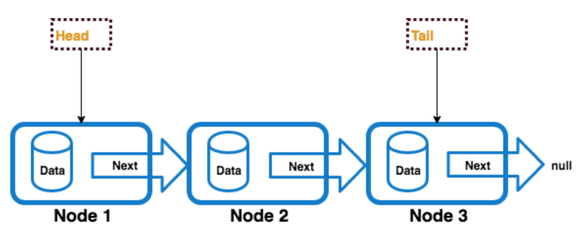

# Linked-list

A linked-list is a linear data structure similar to an array. But in linked-list, elements are not stored in a particular location.


<p align="center">
  
</p>


## Complexity

The average time complexity for insertions, deletion at the beginning is O(1).
The average time complexity for insertions at the end is O(1).
The average time complexity for deletion at the end is O(n).
Space complexity is O(n) because we have to store all values in the linked-list


<details>

<summary>Common Operations</summary>

```
Add
Delete
Traverse
```

</details>


<details>

<summary>Drawbacks</summary>

```
Sequential Access -> Linked list do not offer direct random access

Additional Memory -> linked list require extra memory to store reference.

Reverse Traversal -> Reverse traversal is not allowed in singly linked list.
```

</details>

