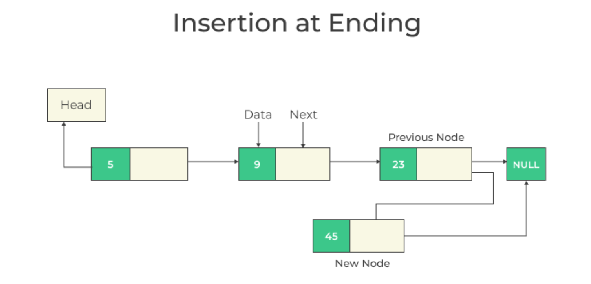
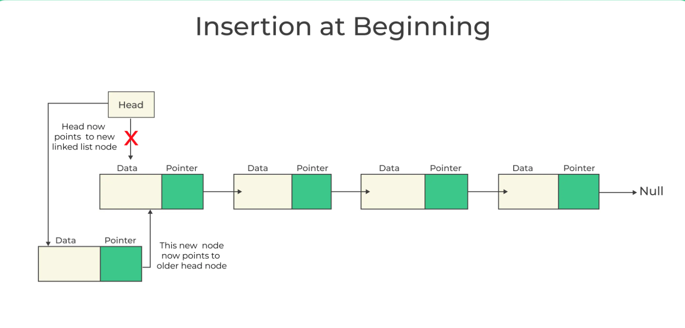
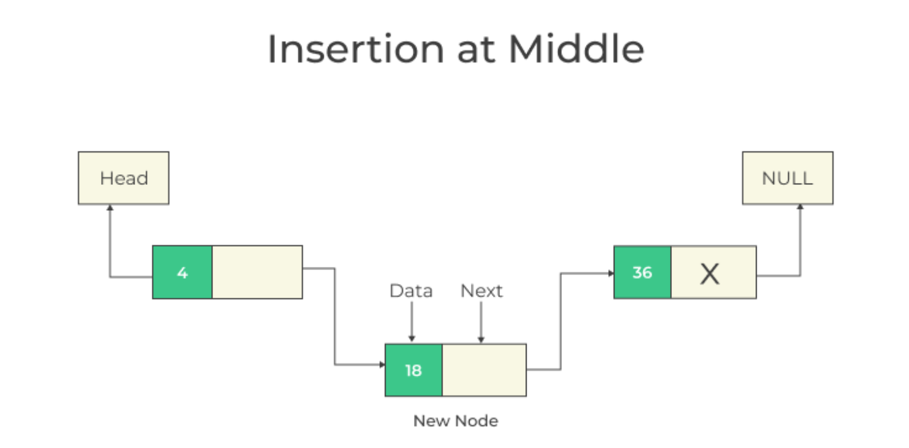

# Custom Linked List

## Node Class

```
class Node {
  constructor(data) {
    this.data = data;
    this.next = null;
  }
}
```

## Class & Constructor

```
class LinkedLst {
  constructor() {
    this.head = null;
    this.tail = null;
  }
}
```


## Add at the end of the linked list

<p align="center">
  
</p>

```
  add(data) {
    const node = new Node(data);

    if (this.head === null) {
      this.head = node;
    } else {
      this.tail.next = node;
    }

    this.tail = node;
  }
```


## Add at the start of the linked list

<p align="center">
  
</p>

```
  insertAtBeginning(data){
    const node = new Node(data);
    node.next = this.head;
    this.head = node;
  }
```


## Add at the middle of the linked list

<p align="center">
  
</p>

```
  insert(index, data){
    if(index === 0){
       this.insertAtBeginning(data);
    }
    else{
        let current = this.head;
        let prev = null;
        let i = 0;

        while(i < index){
            prev = current;
            current = current.next;
            i++;
        }

        const node = new Node(data);
        node.next = current;
        prev.next = node;

    }
  }
```


## Print data of linked-list

```
  print() {
    let current = this.head;

    while (current !== null) {
      console.log(current.data);
      current = current.next;
    }
  }
```


## Remove data from linked-list at position i

```
  removeAt(index){
    if(index === 0){
       this.head = this.head.next;
    }
    else{
        let current = this.head;
        let prev = null;
        let i = 0;

        while(i < index){
            prev = current;
            current = current.next;
            i++;
        }
        prev.next = current.next;

    }
  }
```


## Get data of linked-list at a particular index

```
  get(index) {
    let current = this.head;
    let i = 0;

    while (i < index) {
      if (current.next === null) {
        return false;
      }
      current = current.next;
      i++;
    }
    return current.data;
  }
```
