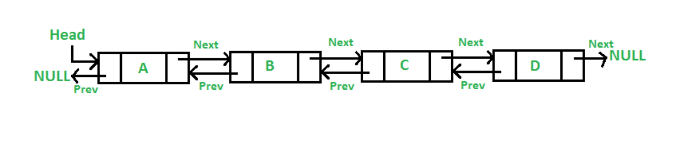
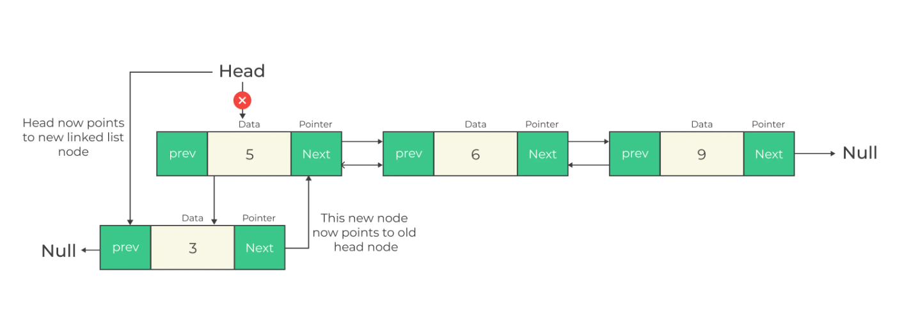
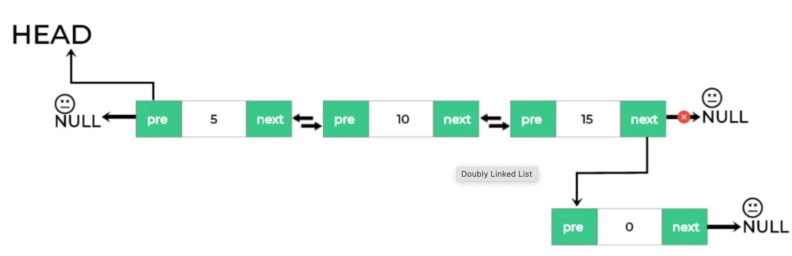
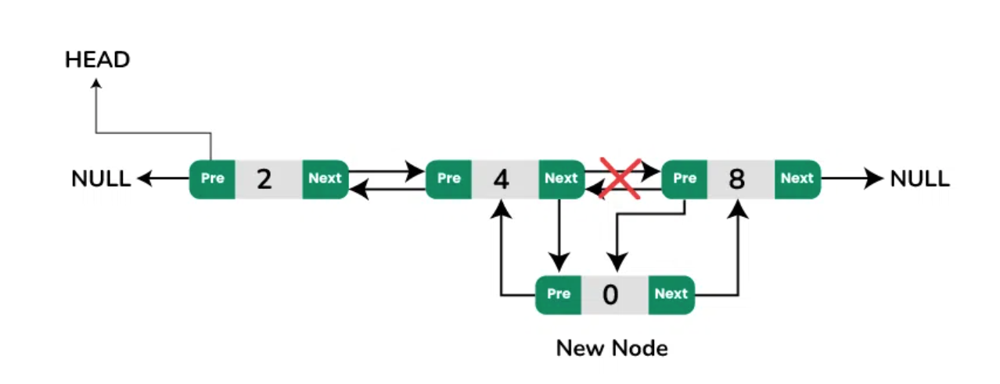
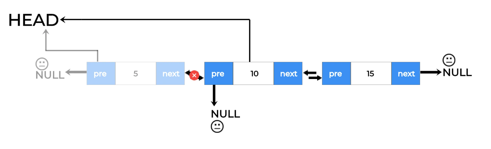
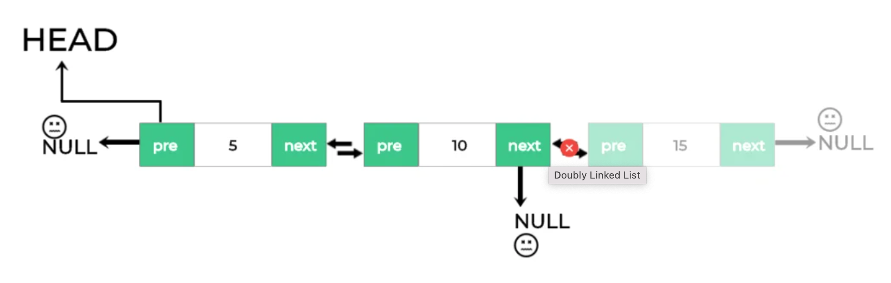
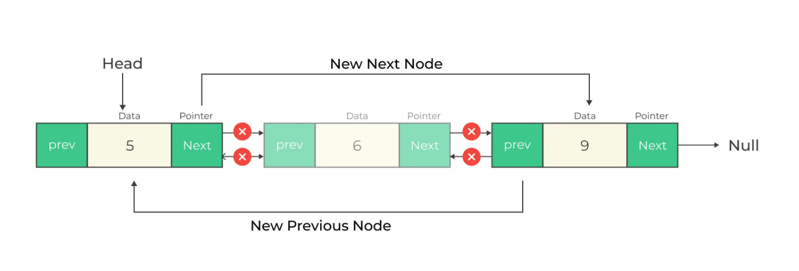

# Doubly-Linked-list

A doubly-linked-list contains an extra pointer (Previous Pointer) which points to the previous node.


<p align="center">
  
</p>


## Complexity

The average time complexity for insertions, deletion at the beginning is O(1).
The average time complexity for insertions, deletion at the end is O(1).
The average time complexity for deletion,deletion at a particular position is O(n).


<details>

<summary>Common Operations</summary>

```
Add
Delete
Traverse
```

</details>


# Custom Linked List

## Node Class

```
class Node {
    constructor(data) {
      this.data = data;
      this.next = null;
      this.prev = null;
    }
}
```

## Class & Constructor

```
class DoublyLinkedList {
    constructor(){
        this.head = null;
        this.tail = null;
        this.length = 0;
    }
}
```


## Add at the starting of the doubly linked list

<p align="center">
  
</p>

```
  insertAtBeginning(data){
      const node = new Node(data);
      if(!this.head){
          this.head = node;
          this.tail = node;
      }
      else {
          node.next = this.head;
          this.head.prev = node;
          this.head = node;
      }
      this.length += 1;
  }
```


## Add at the end of the doubly linked list

<p align="center">
  
</p>

```
  add(data) {
      if(!this.head){
          this.insertAtBeginning(data);
      }
      else {
          const node = new Node(data);
          node.prev = this.tail;
          this.tail.next = node;
          this.tail = node;
          this.length += 1;
      }
  }
```


## Add at the specific position of the doubly linked list

<p align="center">
  
</p>

```
  insertAt(index, data) {

      if(index < 0 || index > this.length) {
          return null;
      }

      if(index === 0){
          this.insertAtBeginning(data);
      }
      else if(index === this.length) {
          this.add(data);
      }
      else {
          let currentNode = this.head;
          const node = new Node(data);
          let i = 0;

          while( i < index - 1) {
              currentNode = currentNode.next;
              i++;
          }

          const nextNode = currentNode.next;;

          // next of new-node = next of current-node
          node.next = nextNode;

          // previous of new-node = current-node
          node.prev = currentNode;

          //now we have to update next of current-node (which is new-node)
          currentNode.next = node;

          //Also we have to update previous of next-node (which is new-node)
          nextNode.prev = node;

          //increment length of the doubly-linked list
          this.length += 1;
      }
  }
```


## print of the doubly linked list

```
  print() {
      let currentNode = this.head;
      while(currentNode !== null){
          console.log(currentNode.data);
          currentNode = currentNode.next;
      }
  }
```


## Get data at the particualr position of the doubly linked list

```
    get(index)  {

        if(index < 0 || index > this.length) {
            return null;
        }

        if(index === 0){
            return this.head.data;
        }
        else if(index === this.length-1) {
            return this.tail.data;
        }
        else {
            let currentNode = this.head;
            let i = 0;

            while( i < index) {
                currentNode = currentNode.next;
                i++;
            }

            return currentNode.data;

        }
    }
```


## Deletion at the beginning of the doubly linked list

<p align="center">
  
</p>

```
  deletionAtBeginning() {
        this.head = this.head.next;

        //Now next item can be null or not
        if(this.head) {
            this.head.prev = null;
        }
        else {
            this.tail = null;
        }

        this.length -= 1;
    }
```


## Deletion at the end of the doubly linked list

<p align="center">
  
</p>

```
    deletionAtLast() {
        this.tail = this.tail.prev;

        //Now previous item can be null or not
        if(this.tail){
            this.tail.next = null;
        }
        else{
            this.head = null;
        }

        this.length -= 1;
    }
```


## Deletion at the specific position of the doubly linked list

<p align="center">
  
</p>

```
    removeAt(index) {

        if(index < 0 || index > this.length) {
            return null;
        }

        console.log(index, this.length)

        if(index === 0){
            this.deletionAtBeginning();
        }
        else if(index === this.length - 1) {
            console.log("deletion at alst")
           this.deletionAtLast();
        }
        else {
            let currentNode = this.head;
            let i = 0;

            while( i < index) {
                currentNode = currentNode.next;
                i++;
            }

            // Now i is the actual index of removal-item

            const prevNode = currentNode.prev;
            const nextNode = currentNode.next;

            prevNode.next = nextNode;
            nextNode.prev = prevNode;

            this.length -= 1;

        }
    }
```


