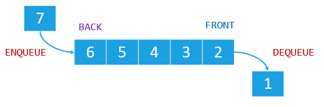

# Stack

A queue is a linear data structure that follows the FIFO (First-In-First-Out) principle. 


<p align="center">
  
</p>


## Complexity

The average time complexity for insertions, deletion is O(1).
Space complexity is O(n) because we have to store all values in the stack


<details>

<summary>Common Methods</summary>

```
push(value) -> Add value to the queue

shift -> To remove first element of the queue
```

</details>